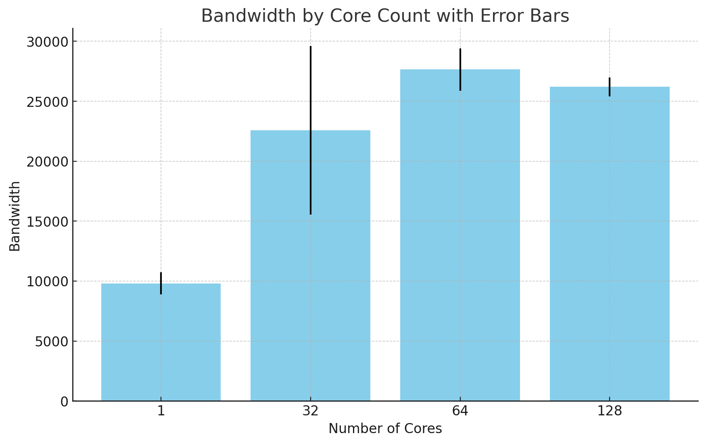
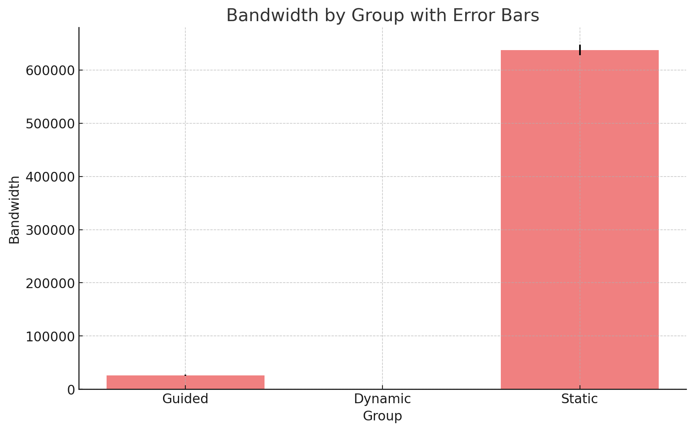

# Assignment 2

## Exercise 1 - Running in parallel

Compiile:

```bash
make compile-1
```

Run:

```bash
make run-1
```

### Questions

1. Write an OpenMP C code with each thread printing Hello World from Thread X! where X is the thread ID.s
2. How do you compile the code in question 1? Which compiler and flags have you used?
   We use the command `cc 1.c -o 1.out -fopenmp`, where the new flag is `-fopenmp`
3. How do you run the OpenMP code on Dardel? What flags did you set?
   We first compile the program as described in 2, then we requested an allocation, setting the flag `--cpus-per-task` to be the number of threads we wish to use.
   After that, we set the enviroment variable `OMP_NUM_THREADS` to the number of threads we wish to use as a default, and ran the program normally.
4. How many different ways can the number of threads in OpenMP be changed? Which are they?
   There are a couple of ways to change the number of threads in Dardel: `Environmental variables` where we define the amount of threads that should be available for the program. You can also use the runtime function `omp_set_num_threads` to set the number of threads to be available within the program. The last relevant way to setting the number of threads is through a clause in the program function that can be defined as follows: `#pragma omp parallel num_threads(4)`

## Exercise 2 - STREAM benchmark and the importance of threads

### Questions

1. Run the STREAM benchmark five times and record the average bandwidth values and its standard deviation for the copy kernel. Prepare a plot (with error bars) comparing the bandwidth using 1,32,64, and 128 threads.
   
2. How does the measured bandwidth with the copy kernel depend on the number of threads?
   It increases up until the point where the CPU can fit all the data in it's cache, at which point it doesn't change significantly.
3. Prepare another plot comparing the bandwidth measured with copy kernel with static, dynamic, and guided schedules using 128 threads.
   
4. How do you set the schedule in the STREAM code? What is the fastest schedule, and why do you think it is so?
   By changing the schedule type in  
   `// HERE YOU CAN CAN CHANGE SCHEDULE`  
   `#pragma omp parallel for schedule(guided)`
   The fastest schedule appears to be the static one, and that is likely due to cache locality, and how the CPU automatically caches the nearby neighbors of the matrix.
   This would speed up static scheduling since it creates larger blocks, and slow down dynamic since it creates split up blocks, which is exactly what we see.

## Excercise 3 - Parallel Sum

1. Measure the performance of the serial code (average + standard deviation).
   The first serial summation yields the following result:
   **0.030918s** with the standard deviation of **0.003532s**
2. Implement a parallel version of the serial_sum called omp_sum and use the omp parallel for construct to parallelize the program. Run the code with 32 threads and measure the execution time (average + standard deviation). Should the code be working correctly? If not, why not?
   **0.010877** for the average execution time, with a standard deviation of **0.001138**
3. Implement a new version called omp_critical_sum and use the omp critical to protect the code region that might be updated by multiple threads concurrently. Measure the execution time for the code in questions 2 and 3 by varying the number of threads: 1, 2, 4, 8, 16, 20, 24, 28, and 32. How does the performance compare to the program in questions 1 and 2? What is the reason for the performance gain/loss?

| Threads | OMP average (s) | OMP stdev (s) | OMP_Critical average (s) | OMP critical stdev (s) |
| ------- | --------------- | ------------- | ------------------------ | ---------------------- |
| 1       | 0.030775        | 0.004164      | 0.148550                 | 0.002014               |
| 2       | 0.014511        | 0.000206      | 0.603945                 | 0.024622               |
| 4       | 0.009709        | 0.002888      | 0.876019                 | 0.047986               |
| 8       | 0.009071        | 0.001698      | 0.796292                 | 0.065304               |
| 16      | 0.009845        | 0.001611      | 0.791318                 | 0.047733               |
| 20      | 0.009608        | 0.000938      | 0.700794                 | 0.088253               |
| 24      | 0.009032        | 0.000654      | 0.731100                 | 0.036617               |
| 28      | 0.009018        | 0.000725      | 0.822434                 | 0.030504               |
| 32      | 0.011317        | 0.007199      | 0.708248                 | 0.046975               |

The critical performs much worse than the paralell function, the reason for this is that we create a bottleneck directly after paralellizing, spending resources on spinning up threads, then not using them. Since only one thread can go through the summation operation at a time in the critical mode, we loose all the gains, making it useless in this specific scenario.

4. Try to avoid the use of a critical section. Implement a new version called omp_local_sum. Let each thread find the local sum in its own data, then combine their local result to get the final result. For instance, we can use temporary arrays indexed by their thread number to hold the values found by each thread, like the code below.

- double local_sum[MAX_THREADS];
- Measure the performance of the new implementation, varying the number of threads to 1,32,64 and 128 threads. Does the performance increase as expected? If not, why not?

| Threads | Average time | Standard deviation |
| ------- | ------------ | ------------------ |
| 1       | 0.032180     | 0.003682           |
| 32      | 0.021223     | 0.006190           |
| 64      | 0.014025     | 0.002157           |
| 128     | 0.011615     | 0.001602           |

5. Write a new version of the code in question 4 called opt_local_sum using a technique to remove false sharing with padding. Measure the performance of the code by varying the number of threads to 1, 32, 64, and 128.

| Threads | Average time | Standard deviation |
| ------- | ------------ | ------------------ |
| 1       | 0.029667     | 0.000946           |
| 32      | 0.009408     | 0.000889           |
| 64      | 0.009614     | 0.002048           |
| 128     | 0.009427     | 0.001502           |

## Excercise 4

1. Parallelize the DFTW code with OpenMP. You can develop different strategies. The important point is that the code produces the correct results and is fast!
   ✅
2. Measure the performance on Dardel 32 cores, reporting the average values and standard deviation for DFTW using an input size equal to 10000 (N=10000).
   The average value is 0.8316936 with a standard deviation of 0.008005.
3. Prepare a speed-up plot varying the number of threads: 1,32,64, and 128.
   | Threads | Execution time |
   | ------- | ------------ |
   | 1 | 25.933433 |
   | 32 | 0.837960 |
   | 64 | 0.438074 |
   | 128 | 0.332444 |

4. Which performance optimizations (think about what you learned in the previous module) would be suitable for DFT other than parallelization with OpenMP? Explain, no need to implement the optimizations.

Obviously parallelizing this module is benefitial and improves the performance, however in addition to that we can also use spatial caching since there is a lot of array-index checking within the for loop. If we can increase the number of cache hits within the inner for loop then we gain a lot of time.
It should also be possible to use reduction to make the summation go faster.
